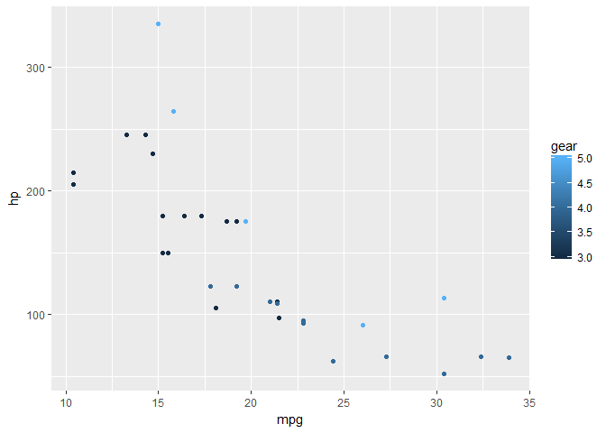

[](https://travis-ci.org/seasmith/ggloop)

ggloop
======

> Create ggplot2 plots in a loop.

Overview
--------

ggloop allows the user to use both dplyr-like and ggplot2-like syntax to either create multiple ggplot2 plots or create the list of aesthetics used to make such plots. This has the potential to save the users on the amount of code within their projects or sessions.

Installation
------------

``` r
## CRAN
install.packages("ggloop")

## GitHub
devtools::install_github("seasmith/ggloop")  
```

Where can I learn about how to use `ggloop`?
--------------------------------------------

You can see `ggloop` in action with the intro vignette (`vignette("intro", "ggloop")`). You can also read the very brief overview of the functions and example below.

The functions
-------------

`ggloop` has three exported functions:

-   `ggloop(data, mappings = aes_loop(), remap_xy = TRUE, remap_dots = FALSE, ..., environment = parent.frame() )` = Meant to mimick `ggplot()`'s arguments with additional remap arguments to control the remapping behavior of the mappings. There are three possible returned values:
    -   A single ggplot object = Created by `x`, `y`, and `...` arguments of length one or less.
    -   A list of ggplot objects = Created when there is no `...` argument in `aes_loop()`.
    -   A nest list (a list of a list) of ggplot objects = Created when a `...` argument is supplied. `...` names sit on the top-level of the nested list (they divide the list into however many parts based on the number of such arguments and the remapping behavior). `x` and `y` sit at the bottom-level of the nested list
-   `aes_loop()` = meant to mimick `aes()`; can accept one or more arguments (a vector of arguments) with dplyr-like and ggplot2-like syntax; both syntax styles can be combined for one argument using the `c()` as a wrapper and only `c()`.
    -   dplyr-like = `mpg:hp`, `1`, `5:9`, `cyl`, etc
    -   ggplot2-like = `factor(cyl)`, `gear + cyl`, etc
-   `%L+%` = magrittr-like (rip-off) `+` operator to accomodate the addition of geoms, stats, etc to any of the returned values of `ggloop()`

How to use ggloop
-----------------

A simple example:

``` r
library(ggloop)
library(ggplot2)
g <- ggloop(data = mtcars, 
            mappings = aes_loop(x = c(mpg:hp, mpg/cyl), 
                                y = c(hp:mpg, disp/hp),
                                color = gear), 
            remap_xy = FALSE)
g <- g %L+% geom_point()  ## add a simple point geom to every ggplot object
g$color.gear$x.mpg_y.hp  ## view one of the plots
```


